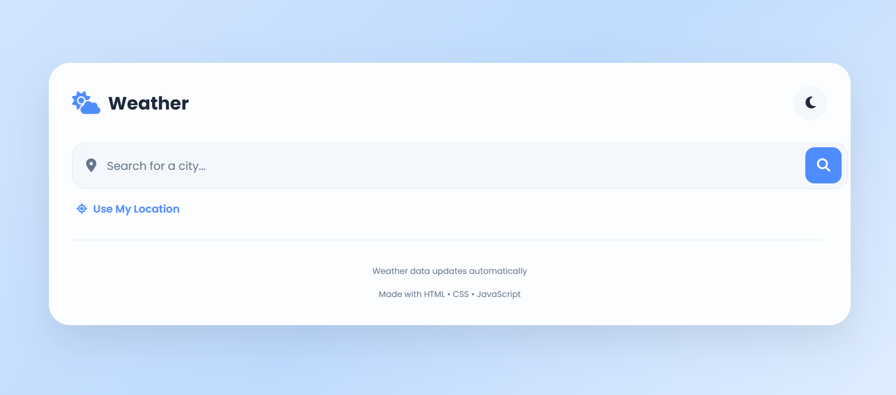
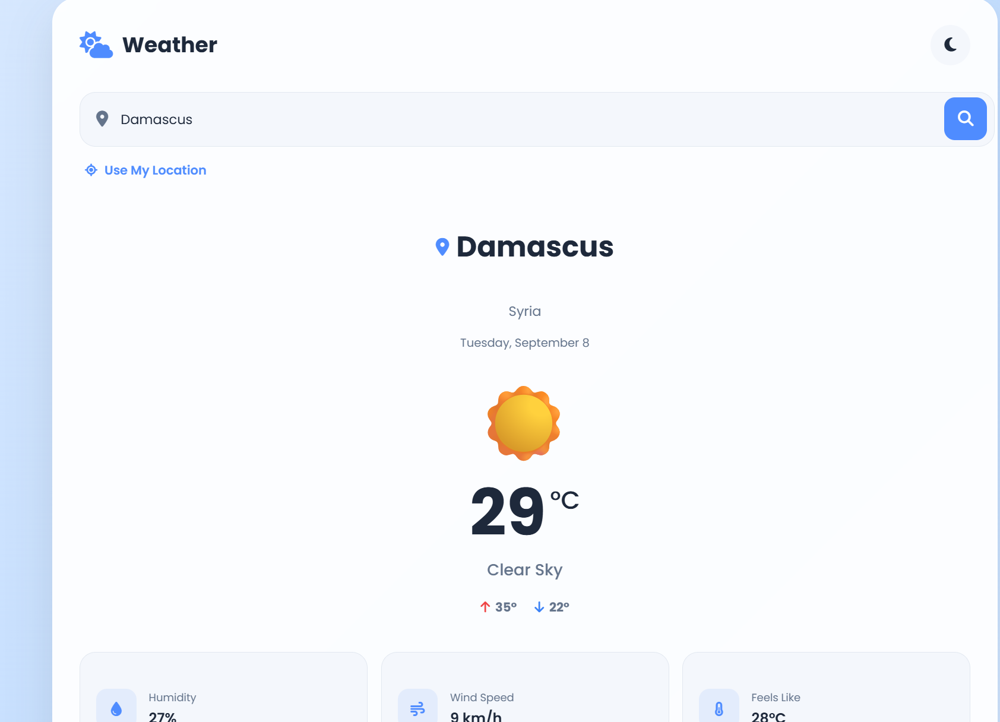
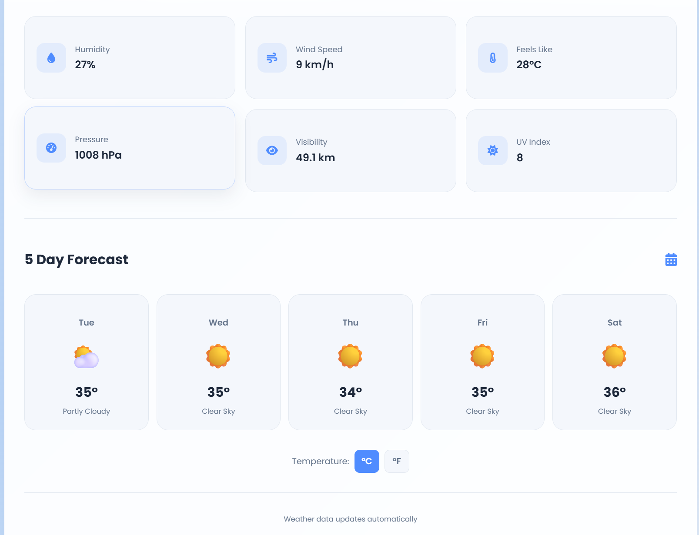

# 🌤️ Weather App

A responsive weather application built with **HTML, CSS, and JavaScript**, using the **Open-Meteo API** to fetch real-time weather data and forecasts.

## 🚀 Live Demo

[View Live Demo]( https://adnanalkrde.github.io/weather-app/)

## 📸 Screenshots

### Home Page



### Weather Details



### 5-Day Forecast



## 📌 Features

* 🔍 Search for weather by city
* 📍 Get weather using the user's current location
* 🌡️ Display current temperature and weather conditions
* 📅 Display weather forecast
* 📱 Fully responsive design
* ⚡ Fetch weather data using JavaScript Fetch API
* 🌐 Uses Open-Meteo API

## 🛠️ Technologies

* HTML5
* CSS3
* JavaScript (ES6+)
* Fetch API
* Open-Meteo API
* Geolocation API
* Git & GitHub

## 📂 Project Structure

```text
weather-app/
│
├── index.html
├── style.css
├── script.js
└── README.md
```

## 🎯 What I Learned

Through this project, I practiced:

* Working with REST APIs
* Using `fetch()` to request data
* Handling asynchronous operations
* Working with `async/await`
* Working with JSON data
* Using the Geolocation API
* Updating the DOM dynamically
* Building responsive interfaces
* Handling user input and errors

## 👨‍💻 Author

**Adnan Alkrde**

Front-End Developer | HTML • CSS • JavaScript

---

⭐ If you like this project, feel free to give it a star!
